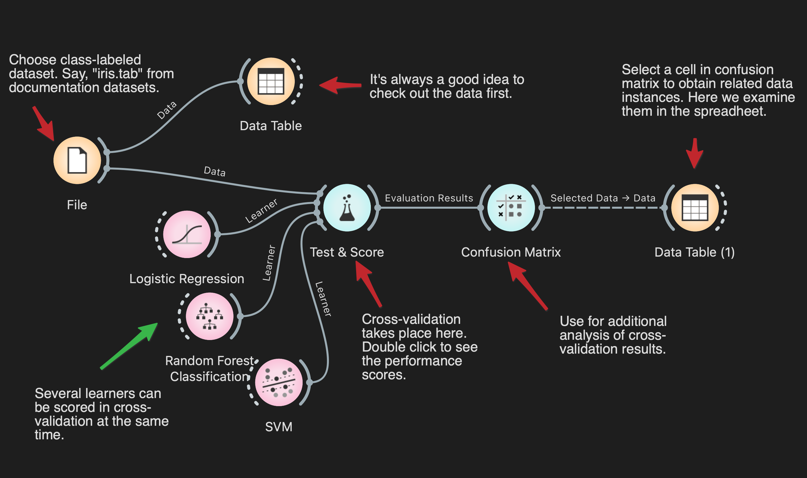

# YMT5270 - Yenilikçi Makine Öğrenme Ortamları
## Ara Sınav Projesi

### Genel Bakış

Bu ödev, YMT5270 - Yenilikçi Makine Öğrenme Ortamları dersi kapsamında verilen ara sınav projesidir. Bu projede, kod yazmadan görsel programlama aracı olan [Orange Data Mining](https://orangedatamining.com/) platformunu kullanarak veri analizi ve makine öğrenmesi uygulamaları geliştirmeniz beklenmektedir.

### Proje Hedefleri

Bu projenin ana hedefleri:

1. Orange Data Mining platformunu etkili bir şekilde kullanabilme becerisi kazanmak
2. Keşifsel Veri Analizi (EDA) tekniklerini uygulamak
3. Seçilen veri setine uygun makine öğrenmesi yöntemlerini uygulamak
4. Veri görselleştirme ve sonuçları yorumlama becerilerini geliştirmek

### Gereksinimler

Projeyi tamamlamak için aşağıdaki gereksinimleri yerine getirmeniz gerekmektedir:

1. **Veri Seti Seçimi**: 
   - [Kaggle](https://www.kaggle.com/datasets), [UCI Machine Learning Repository](https://archive.ics.uci.edu/), [Google Dataset Search](https://datasetsearch.research.google.com/) gibi kaynaklardan bir veri seti seçilmelidir.
   - Veri seti tercihen en az 5 öznitelik ve 100 örnek içermelidir.
   - Veri setinin kaynağı ve lisans bilgileri belirtilmelidir.

2. **Keşifsel Veri Analizi (EDA)**:
   - Veri seti içeriğinin tanımlanması
   - Temel istatistiklerin hesaplanması
   - Eksik verilerin tespit edilmesi ve işlenmesi
   - Aykırı değerlerin belirlenmesi
   - Öznitelikler arasındaki ilişkilerin incelenmesi
   - Uygun görselleştirmelerin yapılması (histogramlar, kutu grafikleri, dağılım grafikleri vb.)

3. **Makine Öğrenmesi Uygulaması**:
   - Veri setinize uygun olarak aşağıdakilerden **BİRİNİ** seçip uygulayınız:
     - **Sınıflandırma**: Hedef değişkeni kategorik ise
     - **Regresyon**: Hedef değişkeni sayısal ise
     - **Kümeleme**: Gözetimsiz öğrenme yaklaşımı kullanmak istiyorsanız

4. **Değerlendirme ve Yorumlama**:
   - Kullanılan modellerin performansının değerlendirilmesi
   - Sonuçların yorumlanması ve önerilerin sunulması

### Teslim Edilecek Dosyalar

1. Doldurulmuş `ReadMe_YourProject.md` dosyası (şablonu bu repoda bulabilirsiniz)
2. Orange proje dosyanız (.ows uzantılı)
3. Kullandığınız veri seti veya veri setinin erişim bağlantısı

### Orange Data Mining Kurulumu ve Kullanımı

1. Orange Data Mining platformunu [resmi web sitesinden](https://orangedatamining.com/download/) indirip kurabilirsiniz.
2. Temel kullanım için [Orange Video Eğitimleri](https://www.youtube.com/c/OrangeDataMining) izlenebilir.
3. Ayrıca [Orange Dokümantasyonu](https://orangedatamining.com/docs/) detaylı bilgi için faydalı olacaktır.

### Örnek İş Akışı

Aşağıda basit bir örnek iş akışı gösterilmiştir:

Repodaki `example` klasöründe örnek bir Orange iş akışı dosyası bulabilirsiniz. 
- Lütfen kendi proje iş akışı dosyanızı `project` klasörüne yükleyiniz. 

### Değerlendirme Kriterleri

| Kriter | Ağırlık |
|--------|---------|
| Veri seti seçimi ve tanımlama | %15 |
| Keşifsel veri analizi (EDA) kalitesi | %25 |
| Makine öğrenmesi uygulaması | %30 |
| Sonuçların yorumlanması | %20 |
| Dokümantasyon ve rapor kalitesi | %10 |

### Önemli Tarihler

- **Proje Duyurusu**: 20 Nisan 2025
- **Teslim Tarihi**: 15 Mayıs 2025, 23:59

### Akademik Dürüstlük ve Etik Beyanı

Bu ödev bireysel bir çalışmadır. Başkalarının çalışmalarını kendinizinmiş gibi sunmak akademik etik kurallarına aykırıdır. 
Yararlandığınız tüm kaynakları uygun şekilde belirtmeniz gerekmektedir.

### İletişim

Sorularınız için: fucar@firat.edu.tr

---

**Not**: Bu repo, GitHub Classroom üzerinden assignment ile oluşturulmuştur. Projenizi tamamladıktan sonra GitHub Classroom assignment submit edilmelidir.
